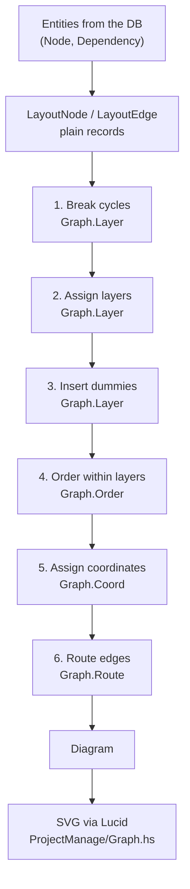

# Dependency Graph Rendering

> **Status: in flight.** This describes the design the graph is being
> built to. Today the graph is still rendered by D3 on the client
> (`static/script/nodetree2.js`); every phase below marked ⏳ does not
> exist yet.
>
> The status table is the source of truth for what has landed — check it
> before reading any section as a description of current behaviour. Each
> issue flips its own row as it merges, and #183 drops this status line
> once nothing is ⏳.

| Phase / concern | Issue | Status |
|---|---|---|
| Types, cycle breaking, layer assignment, flagged SVG render | #173 | ⏳ |
| x-coordinate assignment (median/priority) | #174 | ⏳ |
| Orthogonal routing: ports and tracks | #175 | ⏳ |
| Dummy nodes for multi-level edges | #176 | ⏳ |
| Crossing reduction | #177 | ⏳ |
| Node chrome (rects, labels, palette) | #178 | ⏳ |
| Scroll-and-zoom viewport | #179 | ⏳ |
| Line jumps at crossings | #180 | ⏳ |
| Cutover: server layout by default | #181 | ⏳ |
| D3 deleted | #182 | ⏳ |
| This doc reconciled with reality | #183 | ⏳ |

For *why* any of this was chosen — the options weighed, the algorithms
rejected, the requirements derived from the reference images — see
[`../solution-proposals/haskell-graph-rendering.md`](../solution-proposals/haskell-graph-rendering.md).
That document is a frozen decision record; **this** one is the live
reference. When they disagree, this one wins and the other one is
history.

For how to *work with* the surrounding code — running the app, the
`#container`/`#view` pattern, Lucid conventions, running the test suites
— see [`../development/`](../development/). This doc covers the graph's
design; that directory covers the day-to-day.

## What the change is, in one paragraph

The project dependency graph moves from "server sends JSON, client
computes positions with D3" to "server computes positions, client
receives finished SVG". Layout becomes a pure Haskell pipeline of the
[layered graph drawing](https://en.wikipedia.org/wiki/Layered_graph_drawing)
family (nodes in rows by dependency depth, edges as right-angle
polylines), rendered to SVG by the existing Lucid vocabulary. D3 goes
away entirely, including the 280KB `<script>` that currently loads on
every page in the app.

## The pipeline



Everything from `LayoutNode`/`LayoutEdge` to `Diagram` is pure. The
responder does the I/O on either side of it and nothing else.

## Module map

| Module | Owns | Issue |
|---|---|---|
| `Domain.Project.Graph.Types` | Every type below; no logic | #173 |
| `Domain.Project.Graph.Layer` | Cycle breaking, layer assignment, dummy insertion | #173, #176 |
| `Domain.Project.Graph.Order` | Crossing reduction, crossing counter | #177 |
| `Domain.Project.Graph.Coord` | x/y assignment, component packing | #174 |
| `Domain.Project.Graph.Route` | Ports, tracks, polylines, line jumps | #175, #180 |
| `Domain.Project.Graph.Layout` | The pipeline; the one entry point callers use | #173 |
| `Domain.Project.Responder.Ui.ProjectManage.Graph` | Queries, entity → layout conversion, SVG rendering | #173 |

### The one hard rule

**Nothing under `Domain.Project.Graph.*` may import `Database.*`,
`persistent`, `Esqueleto`, `Lucid`, or anything from `Network.Wai`.**

The layout engine takes plain records and returns plain records. This is
not stylistic: it is what keeps these modules inside the "pure,
dependency-free" tier that
[`../development/unit-testing.md`](../development/unit-testing.md) says the unit suite covers,
alongside `Common.Validation` and `Data.Text.Util`. A single `persistent`
import in `Graph.Coord` would drag the whole pipeline into the
integration-test tier and cost this effort its main advantage over the
JS it replaces.

Conversion lives in the responder: entities in, `LayoutNode`/`LayoutEdge`
out, `Diagram` back, SVG rendered.

## Core types

```haskell
-- Domain.Project.Graph.Types

newtype NodeId = NodeId Int64  deriving (Eq, Ord, Show)
newtype EdgeId = EdgeId Int64  deriving (Eq, Ord, Show)

data NodeKind = RootNode | WorkNode deriving (Eq, Show)

data LayoutNode = LayoutNode
  { lnId    :: NodeId
  , lnKind  :: NodeKind
  , lnLabel :: Text        -- raw title; wrapped during rendering
  }

data LayoutEdge = LayoutEdge
  { leId         :: EdgeId
  , leDependency :: NodeId  -- must be completed first
  , leDependent  :: NodeId  -- waits on it
  }
```

**`leDependency`/`leDependent`, never `source`/`target`.** See
[Edge direction](#edge-direction-and-the-trap-it-hides) — the field
names are the guard rail, and generic names are what let the current
code point its arrowheads the wrong way.

```haskell
data Point = Point { ptX :: Double, ptY :: Double }
data Size  = Size  { szW :: Double, szH :: Double }
data Bounds = Bounds { bMin :: Point, bMax :: Point }

data PlacedNode = PlacedNode
  { pnId      :: NodeId
  , pnKind    :: NodeKind
  , pnLines   :: [Text]   -- label, already wrapped to the box
  , pnTopLeft :: Point
  , pnSize    :: Size
  }

data PlacedEdge = PlacedEdge
  { peId       :: EdgeId
  , pePoints   :: [Point] -- polyline; head sits on the dependency,
                          -- last sits on the dependent and carries
                          -- the arrowhead
  , peReversed :: Bool    -- reversed for layering only (see §Cycles);
                          -- does NOT change which end is the arrow
  }

data Diagram = Diagram
  { diagramNodes      :: [PlacedNode]  -- real nodes only; never dummies
  , diagramEdges      :: [PlacedEdge]
  , diagramBounds     :: Bounds
  , diagramRootAnchor :: Maybe Point   -- initial scroll target (#179)
  }

data LayoutConfig = LayoutConfig
  { cfgNodeSize   :: Size
  , cfgLayerGap   :: Double  -- vertical space between rows
  , cfgNodeGap    :: Double  -- minimum horizontal space between boxes
  , cfgTrackGap   :: Double  -- vertical space between routing tracks
  , cfgLabelWidth :: Int     -- characters per label line
  , cfgLabelLines :: Int     -- maximum label lines
  , cfgMargin     :: Double  -- padding around the whole drawing
  }
```

And the entry point every caller uses:

```haskell
-- Domain.Project.Graph.Layout
layout :: LayoutConfig -> [LayoutNode] -> [LayoutEdge] -> Diagram
```

`layout` is **total**. It must produce a `Diagram` for any input: cycles,
duplicate edges, disconnected components, an empty graph, a node with no
project root. Layout never fails — see [Cycles](#cycles).

## Phase contracts

Each phase is a function from one representation to the next, and each
guarantees an invariant the next phase relies on. The invariants are
what the unit tests assert.

### 1. Break cycles — `Graph.Layer` ⏳ #173

DFS from every unvisited node; an edge pointing back at a node currently
on the stack is a back edge and gets reversed for layout purposes, with
`peReversed` recorded. Tie-breaks by `NodeId`, so the choice is stable
across runs.

**Guarantees:** the edge set is acyclic.

### 2. Assign layers — `Graph.Layer` ⏳ #173

Longest-path layering over a topological order: a node with no
dependencies is layer 0; otherwise `1 + max` over its dependencies.

**Guarantees:** every edge spans at least one layer, in a consistent
direction. Layers are contiguous from 0. Disconnected components are
layered independently.

### 3. Insert dummies — `Graph.Layer` ⏳ #176

An edge spanning layers 2→5 becomes a chain through one dummy per
intervening layer.

**Guarantees:** every edge connects *adjacent* layers, which is what
lets phases 4–6 stay simple.

**Dummies are internal.** They occupy a slot in their layer's ordering
and get coordinates, then phase 6 consumes each one as a bend point.
They never reach `Diagram`, and no element, id or label is ever emitted
for one. Their only visible effect is spacing: reserving room in the
rows an edge crosses is what opens the channel it routes along, and what
stops a multi-level edge being drawn through a node box.

### 4. Order within layers — `Graph.Order` ⏳ #177

DFS-seeded initial ordering, then alternating down/up sweeps placing
each node at the median position of its neighbours in the adjacent
layer, for a fixed pass count, keeping the best ordering seen. Crossings
are counted exactly (inversion count between adjacent layers).

**Guarantees:** each layer's ordering is a permutation of its members.
Output is deterministic for a given input.

### 5. Assign coordinates — `Graph.Coord` ⏳ #174

`y = layer * (nodeHeight + cfgLayerGap)`. `x` by the priority/median
method: each node wants the median x of its neighbours in the previous
layer; conflicts resolved in priority order (dummy chains first, so long
edges stay straight, then by degree), pushing lower-priority neighbours
aside to preserve `cfgNodeGap`. Components packed left to right.

**Guarantees:** no two node boxes overlap; every pair is at least
`cfgNodeGap` apart horizontally.

### 6. Route edges — `Graph.Route` ⏳ #175, #180

- **Ports.** Each node side carries slots. An edge claims the slot
  matching the direction it arrives from; slots on a side are ordered by
  the opposite endpoint's position, so edges meeting the same side don't
  cross at the boundary. Multiple edges into one node get **distinct,
  spread** ports — never merged into a shared trunk.
- **Tracks.** The inter-layer gap divides into horizontal tracks. Each
  horizontal run gets a track such that no two edges share a track *and*
  an overlapping x-interval (greedy interval colouring by span). The
  gap's height follows from the tracks actually used, so simple graphs
  stay tight.
- **Polylines.** Vertical out of the source port, horizontal along the
  track, vertical into the target port — at most two bends per adjacent-
  layer edge.
- **Line jumps** (#180): after routing, horizontal/vertical crossings
  get a small arc in the horizontal segment so the reader can see the
  lines don't connect.

**Guarantees:** every segment is axis-aligned. No polyline intersects a
node box. No two horizontal runs overlap collinearly.

## Coordinate conventions

- SVG coordinates: **x right, y down**. One layout unit is one CSS pixel
  at the default zoom.
- **Layer 0 is at the top**, at `cfgMargin`. The project root is layer 0,
  and its dependencies descend from it.
- `pnTopLeft` is the box's top-left corner, not its centre. (The current
  D3 code positions by centre; do not carry that habit over.)
- `diagramBounds` includes `cfgMargin` on all sides.

## Edge direction, and the trap it hides

**The rule:** `A → B` means **B depends on A being completed first**. The
arrowhead sits on **B, the dependent** — it points from the work that
must finish toward the work waiting on it.

Mapping to the database ([`../development/backend/database-schema.md`](../development/backend/database-schema.md)):
`project.dependency` stores `node_id` **depends on** `to_node_id`.
Therefore:

| Layout field | Database column | Gets the arrowhead? |
|---|---|---|
| `leDependency` | `to_node_id` | no — the tail |
| `leDependent` | `node_id` | **yes — the head** |

**This is the reverse of what the app draws today.** `toGraph` builds
`GraphLink { source = node_id, target = to_node_id }` and the renderer
puts `marker-end` on the target — so today's arrowheads sit on the
*dependency*. Anyone porting the existing conversion function will
inherit the bug unless they flip it.

This is exactly why `LayoutEdge`'s fields are named for the relationship
rather than `source`/`target`: with semantic names, getting it backwards
requires writing something that reads obviously wrong.

Reversed edges (from cycle breaking) are a layout-time device only. The
renderer still draws the arrowhead at the true dependent end.

## Rendering

`templateGraph :: Diagram -> Html ()` emits the whole drawing with
coordinates baked in. No `#graph-data` JSON, no layout script.

- `<svg>` carries a `viewBox` from `diagramBounds` **and** explicit pixel
  `width`/`height`, so it renders at natural size and overflows its
  container on a large project. It is deliberately *not* scaled to fit —
  see [Viewport](#viewport).
- Nodes: `<g class="node" transform="translate(x,y)">` wrapping a
  `<rect rx>` and a `<text>` of `<tspan>` lines.
- Edges: `<path class="link" d="M… L… L…">` with `marker-end`.
- New SVG elements/attributes go in `Common.Web.Elements` /
  `Common.Web.Attributes` — the established extension point (see
  [`../development/ui/haskell-rendering.md`](../development/ui/haskell-rendering.md)). `rect_` and
  `transform_` do not exist yet and belong there, not inline.

### Labels

Node boxes are a **fixed size**, and labels wrap to fit via
`Data.Text.Util.wrapLabel` at `cfgLabelWidth`/`cfgLabelLines`. This is
deliberate: the server cannot measure rendered text, so the alternative
would be a font-metrics table. Fixing the box and wrapping the label
sidesteps the problem entirely, and uniform boxes are the target look
anyway. Full titles remain available in the node detail panel.

### The DOM contract — do not change these

The CSS, the htmx wiring and the e2e suite all bind to these. Keeping
them stable through the cutover is what lets `e2e/tests/graph.spec.ts`
act as a regression check on the rewrite instead of being rewritten
alongside it.

| Selector | Depended on by |
|---|---|
| `#tree-container` | `manage-project.css` (sizing, and the scroll container in #179) |
| `#graph-nodes`, `#graph-links` | `graph.spec.ts`, CSS |
| `#node-<id>` | `graph.spec.ts`, the node-detail refresh hook |
| `.node`, `.node-highlight`, `.flash` | CSS, `graph.spec.ts` |
| `.link` | CSS |
| `hx-get`/`hx-target="#node-panel"`/`hx-push-url` on each node | the whole node-detail interaction |

The one deliberate break is `circle` → `rect`: CSS selectors and one
e2e assertion change with it (#178, #181).

### Palette

The reference images in #169 supply **shape and layout only, not
colour**. The graph keeps the app's own theme: `global.css`'s
`--bg-start`/`--bg-end` background, `--accent-bold` for the root node,
`--accent-light` for work nodes, `--text-primary` for labels. See
[`../development/ui/design-system.md`](../development/ui/design-system.md).

## Viewport ⏳ #179

The graph is a **navigable viewport, not a fit-to-screen picture**. A
large project is expected to overflow the view.

- **Opens at a fixed, readable scale** — never scaled down to fit, which
  would shrink titles past legibility on a big project.
- **Initial scroll is anchored on the project root**, using
  `diagramRootAnchor` emitted as a data attribute; the server already
  knows the coordinate, so the client never has to find it.
- **Panning is native scrolling.** `#tree-container` gets
  `overflow: auto`, which brings wheel, trackpad, touch drag with
  momentum, and keyboard scrolling for free.
- **Scrollbars are hidden** (`scrollbar-width: none`,
  `::-webkit-scrollbar { display: none }`). Two consequences follow, and
  both are part of #179 rather than afterthoughts:
  - **Pointer-drag panning must exist**, since dragging a scrollbar is
    no longer possible and a wheel-less mouse would otherwise be stuck.
    A pointer drag adjusts `scrollLeft`/`scrollTop`, with a grab cursor.
  - **A fit/recenter control must exist**, because scrollbars were also
    the "there is more canvas, and here is where you are" cue. The
    container also stays focusable so keyboard scrolling still works.
- **Zoom** is the only genuinely custom behaviour: a scale factor on the
  SVG's `width`/`height`, driven by +/− controls, `ctrl`/`cmd`+wheel
  (what trackpad pinch reports as), and two-pointer touch pinch.

## Cycles

`project.dependency` permits cycles — `UNIQUE (node_id, to_node_id)`
stops duplicate edges, not loops — and no application-level validation
exists yet. Layering is only defined on a DAG, so phase 1 breaks cycles
by reversing back edges.

**Layout never refuses to draw.** Erroring on a detected cycle was
considered and rejected: a graph that won't display is a worse failure
than one drawn with an edge reversed, and it leaves the user no way to
*see* the cycle in order to fix it.

Preventing cycles at write time is planned as an application feature and
is not part of this effort. When it lands, this phase becomes a backstop
for data that arrived another way (direct SQL, seed scripts, rows
predating the validation) rather than an expected path. It stays either
way: a renderer that assumes well-formed input is a renderer a single
database row can break.

## Testing

Specs mirror the module path, per [`../development/unit-testing.md`](../development/unit-testing.md):

```
test/Domain/Project/Graph/LayerSpec.hs
test/Domain/Project/Graph/OrderSpec.hs
test/Domain/Project/Graph/CoordSpec.hs
test/Domain/Project/Graph/RouteSpec.hs
```

**`hspec-discover` finds the files, but `typeio.cabal`'s
`test-suite spec` stanza lists every spec module under `other-modules`
by hand — a new spec that isn't added there is silently never run.**

The invariants each phase guarantees are the test suite. At minimum:

- No two node boxes overlap, on every fixture.
- Every edge polyline is entirely axis-aligned.
- No edge polyline intersects a node box.
- No two horizontal runs share a track and an overlapping x-interval.
- Every edge's dependency layer is above its dependent's, back edges
  excepted.
- A cyclic input terminates and yields a complete `Diagram`.
- Crossing count on committed fixtures stays at or below a recorded
  baseline.
- The same input yields identical output across runs.

This is the point of the whole exercise: none of these are expressible
against the JS this replaces. Playwright drives the finished page and
cannot call `nodetree2.js`'s layout code, so today the app's most
intricate logic is covered by one smoke test asserting four nodes landed
somewhere without overlapping.

## Deliberately out of scope

Dragging nodes to reposition them, collapsing subtrees, animated or
incremental relayout, edge labels, and *stability under change* (adding
a node produces a deterministic layout, but not necessarily one that
looks similar to the previous layout — that would mean seeding the
ordering phase from the prior result, a much larger design).
